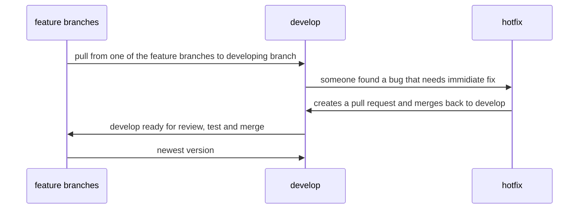

# Interview Prep Answers

# Answer 1.
### IaaS (Infrastructure as a Service): IaaS products allow organizations to manage their business resources — such as their network, servers, and data storage — on the cloud. (Azure, AWS, GCP...)

### PaaS (Platform as a Service): PaaS products allow businesses and developers to host, build, and deploy consumer-facing apps. (Heroku, Vercel, Netlify...)

### SaaS (Software as a Service): By far the most common cloud service, SaaS products offer both consumers and businesses cloud-based tools and applications for everyday use. (DropBox, Jira, Netflix...)


# Answer 2.
### It's a model that involves the use of feature branches and multiple primary branches for example: production, hotfix, release, develop, feature and so on... 
#### in this example prod, release and feature would be primary branches to pull and work from 

### example:


# Answer 3.
### cd => change directory, ls => list current directory, cp => copy files and directories and many more see: [More useful commands](https://www.davekb.com/browse_computer_tips:linux_two_letter_commands:txt)


# Answer 4.
### Sass variables are simple: you assign a value to a name that begins with $, and then you can refer to that name instead of the value itself. Variables are available for Vanilla CSS aswell

# Answer 5.
### String, Number, Boolean, bigint, undefined, Object, Symbol

# Answer 6.
### Global variables are available throughout the length of the code so that it has no scope. The var keyword is used to declare a local variable or object. If the var keyword is omitted, a global variable is declared.

### The problems faced by using global variables are the clash of variable names of local and global scope. Also, it is difficult to debug and test the code that relies on global variables.

# Answer 7.
### ‘This’ keyword refers to the object from where it was called.

# Answer 8.
### “==” checks only for equality in value, whereas “===” is a stricter equality test and returns false if either the value or the type of the two variables are different.

# Answer 9.
### Following are looping structures in Javascript: 
* For 
* While 
* Do-while loops


# Answer 10.
### Since 3 and 2 are integers, they will be added numerically. And since 7 is a string, its concatenation will be done. So the result would be 57.

# Answer 11.
### The NULL value is used to represent no value or no object. It implies no object or null string, no valid boolean value, no number, and no array object.

# Answer 12.
### Undefined value means the:
* Variable used in the code doesn’t exist 
* Variable is not assigned to any value 
* Property does not exist.

# Answer 13.
### Try… Catch—finally is used to handle exceptions in the JavaScript. Example:
```javascript
    Try{
    Code
}
Catch(exp){
    Code to throw an exception.
}
Finally{
    Code runs either it finishes successfully or after catch
}
```

# Answer 14.
### React is:
* a front-end JavaScript library developed by Facebook in 2011.
* It follows the component based approach which helps in building reusable UI components.
* It is used for developing complex and interactive web and mobile UI.
* Even though it was open-sourced only in 2015, it has one of the largest communities supporting it.

# Answer 15.
### Major features of React are:
* It uses the virtual DOM instead of the real DOM.
* It uses server-side rendering.
* It follows uni-directional data flow or data binding.

# Answer 16.
### Although many would argue React is and will be a Library :)

# Answer 17.
### NPM stands for Node Package Manager, responsible for managing all the packages and modules for Node.js.

### Node Package Manager provides two main functionalities:
* Provides online repositories for node.js packages/modules, which are searchable on search.nodejs.org 
* Provides command-line utility to install Node.js packages and also manages Node.js versions and dependencies  

#### example of installing a package:
```bash
npm i package-name
```
#### or
```bash
npm install package-name
```

# Answer 18.
Topic | React | Angular
| :--- | :---: | ---:
ARCHITECTURE  | Only the View of MVC | Complete MVC
RENDERING  | Server-side rendering | Client-side rendering
DOM  | Uses virtual DOM | Uses real DOM
DATA BINDING  | One-way data binding | Two-way data binding
DEBUGGING  | Compile time debugging | Runtime debugging
Created by  | Facebook | Google

# Answer 19.
### SQL is the programming language used to interface with relational databases. (Relational databases model data as records in rows and tables with logical links between them). NoSQL is a class of DBMs that are non-relational and generally do not use SQL.
#### Simply put SQL is relational(horizontal, table like structured) and NoSQL is non-relational(vertical, json like structured)

# Answer 20.
### HTTP pipelining is feature which allows multiple HTTP requests to be sent over a single TCP connection without waiting for the corresponding responses.