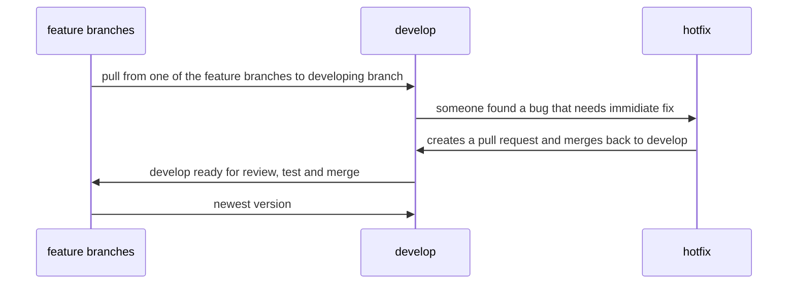

# Example answers

**1. What are SaaS PaaS and IaaS and what's the difference between them?**

> **IaaS** or Infrastructure as a Service products allow organizations to manage their business resources — such as their network, servers, and data storage — on the cloud. Azure, AWS, GCP...

> **PaaS** or Platform as a Service products allow businesses and developers to host, build, and deploy consumer-facing apps. Heroku, Vercel, Netlify...

> **SaaS** or Software as a Service is the most common cloud service, SaaS products offer both consumers and businesses cloud-based tools and applications for everyday use. DropBox, Jira, Netflix...

**2. How does a Git Flow look like?**

It's a model that involves the use of feature branches and multiple primary branches for example: production, hotfix, release, develop, feature and so on. In this example prod, release and feature would be primary branches to pull and work from:

**3. Name three linux commands that only have two letters**

- cd => change directory
- ls => list current directory
- cp => copy
- [More useful commands](https://www.davekb.com/browse_computer_tips:linux_two_letter_commands:txt)

**4. What are variables in Sass?**

Sass variables are simple: you assign a value to a name that begins with $, and then you can refer to that name instead of the value itself. Variables are available for Vanilla CSS as well.

**5. Name JavaScript Data types**

String, Number, Boolean, bigint, undefined, Object, Symbol

**6. What are global variables? How are these variable declared?**

Global variables are available in all scopes of your the code. In JS, globals are properties of the global object, for example `window` in the browser or `global` in Node. If the var, let or const keyword is omitted from a declaration, the variable becomes a global.

**7. What is ‘this’ keyword in JavaScript?**

What the `this` keyword refers to depends on where it is called, usually it refers to the parent function or object of the current scope.

**8. Difference between “==” and “===”?**

The “==” checks only for equality in value, whereas “===” is a strict equality test and returns false if either the value or the type of the two variables are different.

**9. What are the looping structures in JavaScript?**

JS has for loops and while loops, both of which have a few different kinds depending on what you want to loop over.

**10. What would be the result of 3+2+”7″?**

Since the first values 3 and 2 are integers, they will be added numerically first. And since 7 is a string, it will be concatenated to the result of the addition. So the result would be 57.

**11. What do you mean by null in Javascript?**

The null value is used to represent no value or no object. It implies no object or null string, no valid boolean value, no number, and no array object. A null variable is defined, but doesn't have a value.

**12. What is an undefined value in JavaScript?**

Undefined is a value that means the referenced variable or property either doesn't exist or it was explicitly assigned `undefined` as it's value.

**13. Which keywords are used to handle exceptions?**

The keywords `try` and `catch` are used, sometimes in comination with `finally`.

**14. What is React?**

React is:
* A front-end JavaScript library developed by Facebook in 2011
* It follows the component based approach which helps in building reusable UI components
* It is used for developing complex and interactive web and mobile UI
* Even though it was open-sourced only in 2015, it has one of the largest communities supporting it

**15. What are the features of React?**

Major features of React are:
* It uses the virtual DOM instead of the real DOM
* It uses server-side rendering
* It follows uni-directional data flow or data binding

**16. Is React a framework or a library?**
Although some might argue otherwise, React is a library :)

**17. What is NPM?**

Node Package Manager provides two main functionalities:
* It provides a CLI to install Node packages to a local project or globally for the operating system
* It provides connects to online repositories which are searchable on https://www.npmjs.com
* Additionally it can be used for local and private repositories, if needed

**18. How is React different from Angular?**

Topic | React | Angular
| :--- | :---: | ---:
ARCHITECTURE  | Only the View of MVC | Complete MVC
DOM  | Uses virtual DOM | Uses real DOM
DATA BINDING  | One-way data binding | Two-way data binding
DEBUGGING  | Compile time debugging | Runtime debugging
Created by  | Facebook | Google

**19. Difference between NoSQL and SQL**

SQL is the language commonly used to interface with and relational databases. Relational databases model data as records in rows and tables with logical links between them. NoSQL is a class of DBMs that are usually non-relational and usually do not use SQL.
